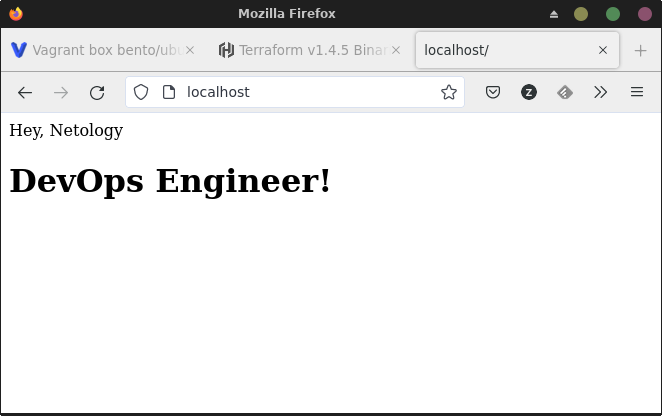
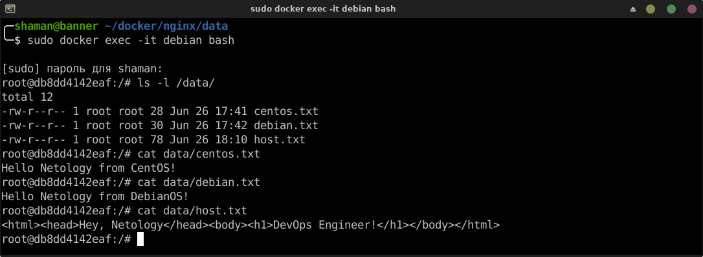

# Домашнее задание к занятию "`Введение. Экосистема. Архитектура. Жизненный цикл Docker контейнера`" - `Живарев Игорь`


### Задание 1

Сценарий выполнения задачи:

создайте свой репозиторий на https://hub.docker.com;
выберите любой образ, который содержит веб-сервер Nginx;
создайте свой fork образа;
реализуйте функциональность: запуск веб-сервера в фоне с индекс-страницей, содержащей HTML-код ниже:
<html>
<head>
Hey, Netology
</head>
<body>
<h1>I’m DevOps Engineer!</h1>
</body>
</html>
Опубликуйте созданный fork в своём репозитории и предоставьте ответ в виде ссылки на https://hub.docker.com/username_repo.


Ответ:

https://hub.docker.com/r/zhivarev/netology_nginx


```
docker pull nginx
docker exec -it nginx-server bash  
    echo '<html><head>Hey, Netology</head><body><h1>DevOps Engineer!</h1></body></html>' > /usr/share/nginx/html/index.html
docker commit nginx-server zhivarev/netology_nginx
docker login -u zhivarev
docker push zhivarev/netology_nginx
```




---

### Задание 2

Посмотрите на сценарий ниже и ответьте на вопрос: «Подходит ли в этом сценарии использование Docker-контейнеров или лучше подойдёт виртуальная машина, физическая машина? Может быть, возможны разные варианты?»

Детально опишите и обоснуйте свой выбор.

--

Сценарий:

- высоконагруженное монолитное Java веб-приложение;
- Nodejs веб-приложение;
- мобильное приложение c версиями для Android и iOS;
- шина данных на базе Apache Kafka;
- Elasticsearch-кластер для реализации логирования продуктивного веб-приложения — три ноды elasticsearch, два logstash и две ноды kibana;
- мониторинг-стек на базе Prometheus и Grafana;
- MongoDB как основное хранилище данных для Java-приложения;
- Gitlab-сервер для реализации CI/CD-процессов и приватный (закрытый) Docker Registry.


Ответ:

> высоконагруженное монолитное Java веб-приложение;
Лучше всего физическая машина, так как Java сама по себе является виртуальной машиной.

> Nodejs веб-приложение;
Докер подойдёт хорошо, т.к. это позволит быстро развернуть приложение со всеми необходимыми библиотеками.

> мобильное приложение c версиями для Android и iOS;
Виртаулка - приложение в докере не имеет GUI, а это решение идёт в разрез с требованием сценария.

> шина данных на базе Apache Kafka;
Да, вполне. Брокеры активно используются в современных распределённых приложениях, доставка приложения через докер на сервера и разработчикам в тестовую среду должна упростить жизнь.
Ещё очень важно иметь возможность быстро откатиться если приложение обновили, и в продакшене что-то пошло не так. Докер будет особенно удобен чтобы "вернуть как было" один из центральных узлов приложения - шину.

> Elasticsearch кластер для реализации логирования продуктивного веб-приложения - три ноды elasticsearch, два logstash и две ноды kibana;
Docker подойдёт лучше, так как он будет удобней для кластеризации: у контейнеров меньше оверхед.

> Мониторинг-стек на базе Prometheus и Grafana;
Докер подойдёт для этой задачи хорошо. Разворвачивать node_exporter с Docker скорей всего не стоит, т.к. ему требуется прямой доступ к метрикам ядра, но Prometheus и Grafana можно использовать в Докере.

> MongoDB, как основное хранилище данных для java-приложения;
Да, вполне подойдёт Docker. У MongoDB даже есть официальный образ на Docker Hub.

> Gitlab сервер для реализации CI/CD процессов и приватный (закрытый) Docker Registry.
В общем случае, думаю удобней будет виртуальная машина, т.к. серверу GitLab не требуется масштабирование или деплой новой версии несколько раз в день, а виртуальная машина позволит очень удобно делать бекапы и при необходимости мигрировать её в кластере.
Если в компании повсеместно используются контейнеры - тогда, может, будет удобней Docker, т.к. инженерам это будет привычней.


### Задание 3


Запустите первый контейнер из образа centos c любым тегом в фоновом режиме, подключив папку /data из текущей рабочей директории на хостовой машине в /data контейнера.
Запустите второй контейнер из образа debian в фоновом режиме, подключив папку /data из текущей рабочей директории на хостовой машине в /data контейнера.
Подключитесь к первому контейнеру с помощью docker exec и создайте текстовый файл любого содержания в /data.
Добавьте ещё один файл в папку /data на хостовой машине.
Подключитесь во второй контейнер и отобразите листинг и содержание файлов в /data контейнера.


Ответ:


```
╭─shaman@banner ~/docker/nginx 
╰─$ sudo docker run -it --rm -d --name centos -v $(pwd)/data:/data centos:latest                                                                                126 ↵
Unable to find image 'centos:latest' locally
latest: Pulling from library/centos
a1d0c7532777: Pull complete 
Digest: sha256:a27fd8080b517143cbbbab9dfb7c8571c40d67d534bbdee55bd6c473f432b177
Status: Downloaded newer image for centos:latest
bd1a22efbe9bc9f2e14453b62d7ea0e9ecbdd02ec137022f23059ea791799ada
╭─shaman@banner ~/docker/nginx 
╰─$ sudo docker run -it --rm -d --name debian -v $(pwd)/data:/data debian:stable                                                                                125 ↵
Unable to find image 'debian:stable' locally
stable: Pulling from library/debian
8e696805849a: Pull complete 
Digest: sha256:ebb8e4f9c0bbf3afde0527942e9531b0d73ecdb658847fc7f56b06a124b84444
Status: Downloaded newer image for debian:stable
db8dd4142eaf6cb647726b11c6dbbd743c40673adf185dd8c9421f44fc5c2c14
╭─shaman@banner ~/docker/nginx 
╰─$ sudo docker images
REPOSITORY                TAG       IMAGE ID       CREATED         SIZE
zhivarev/netology_nginx   latest    9953d14df180   3 hours ago     187MB
<none>                    <none>    ca926d26ff0b   6 hours ago     124MB
nginx                     latest    eb4a57159180   12 days ago     187MB
debian                    stable    2069fecd422e   13 days ago     116MB
centos                    latest    5d0da3dc9764   21 months ago   231MB
╭─shaman@banner ~/docker/nginx 
╰─$ sudo echo '<html><head>Hey, Netology</head><body><h1>DevOps Engineer!</h1></body></html>' > ./data/host.txt
╭─shaman@banner ~/docker/nginx/data 
╰─$ sudo docker exec -it debian bash 
╭─shaman@banner ~/docker/nginx/data 
╰─$ sudo docker exec -it debian bash                                                                           
[sudo] пароль для shaman: 
root@db8dd4142eaf:/# ls -l /data/
total 12
-rw-r--r-- 1 root root 28 Jun 26 17:41 centos.txt
-rw-r--r-- 1 root root 30 Jun 26 17:42 debian.txt
-rw-r--r-- 1 root root 78 Jun 26 18:10 host.txt
root@db8dd4142eaf:/# cat data/centos.txt
Hello Netology from CentOS!
root@db8dd4142eaf:/# cat data/debian.txt
Hello Netology from DebianOS!
root@db8dd4142eaf:/# cat data/host.txt
<html><head>Hey, Netology</head><body><h1>DevOps Engineer!</h1></body></html>
root@db8dd4142eaf:/# 
```




